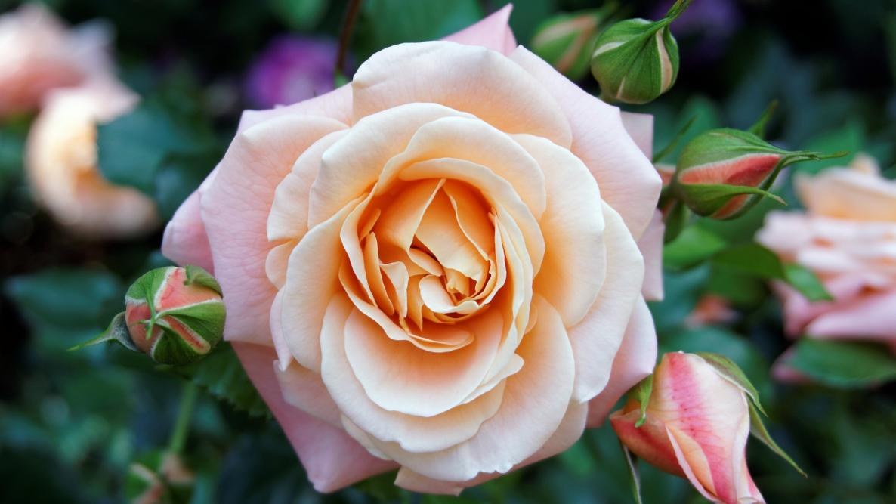
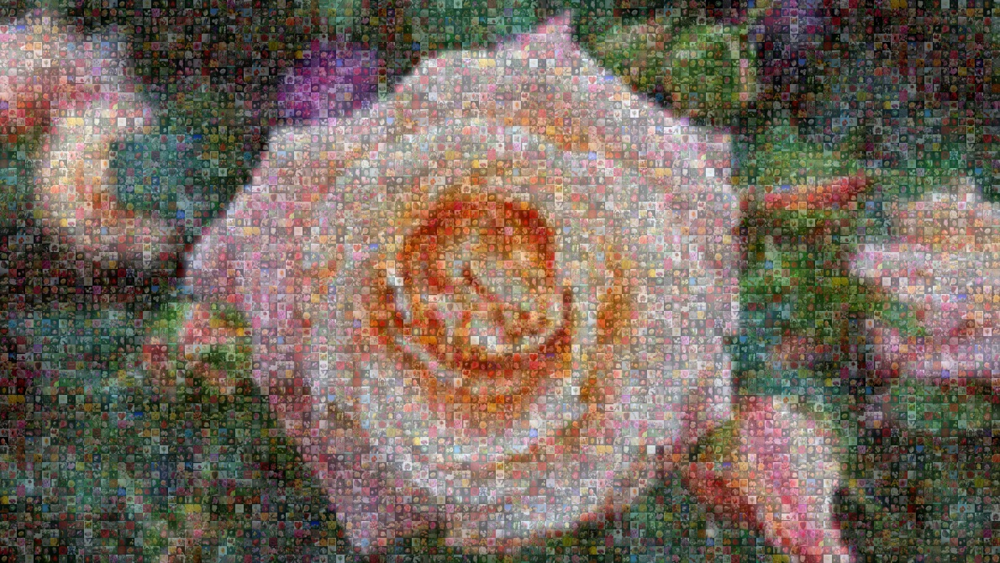
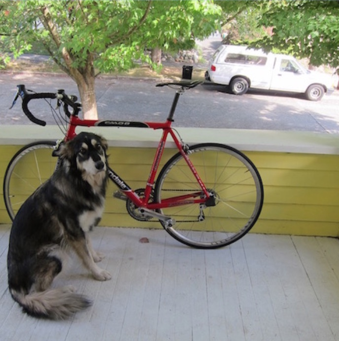
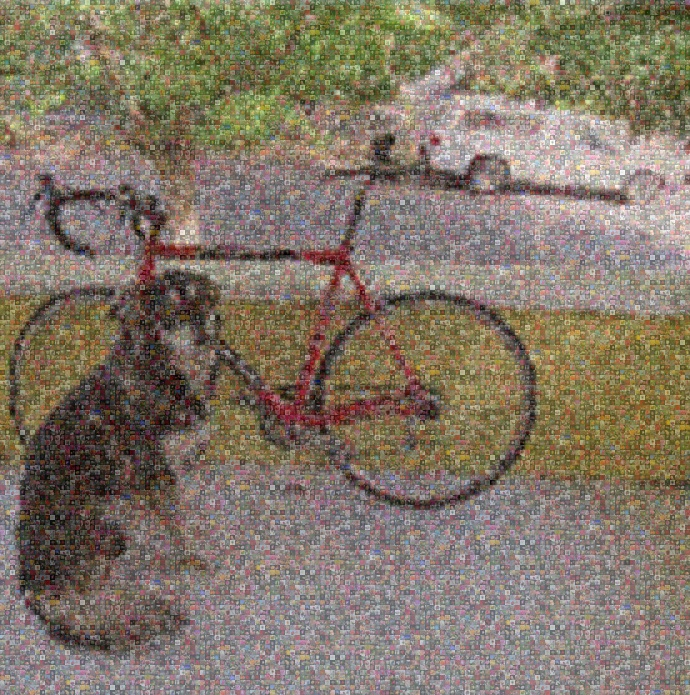

# cse455-fp
## Names
Sonia Saitawdekar and Himani Nijhawan

## Demo Video
[Demo Video Link](https://youtu.be/NsMlCR-vYBI)

## Problem description
We wanted to write a program that would create a mosaic-style artistic version of an image. We wanted to take in an image from the user (or use a default rose image) and turn it into a mosaic of smaller rose images. Based on the input, the goal was to create the mosaic by applying coloring to the smaller pictures to fit the pixel colors of the larger picture. Thus, when the smaller pictures are all put together in a collage, their coloring should reveal the larger picture.

## Approach
The goal was to first figure out how to create the collage of smaller images, and then to figure out how to add some sort of color filter to either the individual pictures before joining them or to the collage as a whole to have it match the colors of the big image. We used the Python Imaging Library (Pillow) to slowly join the images together and create the collage (based on the necessary dimensions). To choose the pixels/colors to represent the larger image, we used NumPy. This let us convert the image to an array, choose every X pixel, and then convert it back into an image. The result was an image of colored squares that represented the location of the smaller images. We then used the Python Imaging Library again to add the color filter to the collage using the blend method, which blends two images together.

After we got this working with a default image and smaller image size, we added the option of user input that let's the user input their own image and size. We had to make sure our code calculated the image size, number of images, and general dimensions based on the inputted big image's dimensions and inputted size. We used global variables to track the big image, size, and number of images that needed to be in the height/width. We factored out each step of the code into helper functions to improve readability.

## Previous work
None of the previous gitlab homework code was used. However, image manipulation was a strong influence on the project idea.

## Datasets
The only dataset used for this was a folder of rose images. This folder came from [Kaggle](https://www.kaggle.com/datasets/alxmamaev/flowers-recognition).
Adidtionally, we have a default "big image" that came from a [different website](https://www.almanac.com/plant/roses).

## Results
We started off with prompting the user with questions in the terminal to determine if they wanted to create the default mosiac (a rose image with size 10 for the smaller images) or enter a personalized image and size. We made sure to note that a smaller size works better for more detailed images.

Once we knew what we were working with, we prepped the color filter by choosing a limited number of pixels from the big image based on the size input (basically creating a more pixalated version of the image). We had to make sure to scale this output back to the original size. The resulted in a image of colored squares that would eventaully match up with the smaller collage of images. The size of these squares (and the smaller images) was determined by the input size. Thus, a smaller size meant more color detail could be represented which would make the larger image more or less recognizable.

We then prepped the collage of smaller images by joining them together to form colums and rows to match the shape of the larger image. To choose the images, we iterated through the dataset and wrapped back around if needed. Finally, we were able to blend the pixalated coloring image with this collage to create the final output.

Here is the before and after for the default rose image with the default image size of 10:
Rose                     |  Rose Mosaic
:-------------------------:|:-------------------------:
    | 

Here is the before and after for a non-default inputted image with a image size of 5:
Dog                     |  Dog Mosaic
:-------------------------:|:-------------------------:
    | 

## Discussion
**Problems:** At first we were struggling to figure out what tools we could use to accomplish our vision. We weren't sure which tasks we would need to program from scratch vs which ones could be easier with the use of python libraries. Once we discovered Pillow's `.new` and `.paste` functions for creating images, we were able to figure out how to create the collage. The coloring was even more confusing because we didn't know if it would be easier to color each image individually or somehow color the collage all at once. We tried playing around with spliting each image into R, G, B image layers and manipulating the values based on the target color we wanted it to resemble. However, there were problems with accessing the values and matching up types of data we had access to. Once we discovered `.blend`, we decided to use that to blend two images together, the collage and a pixelated version of the image which we created using `np.asarray` and `Image.fromarray`.

**Next steps:** One idea would be to allow the user to input their own smaller images so they could use images other than roses to create the mosaic. Currently, the size parameter is based on user input, but technically certain sizes work better for certain images based on how detailed they are. Therefore, we could somehow calculate what size would be best for the image based on the level of detial that could be determined through something like the sobel filter that detects edges.

**Difference from others**: We noticed that some mosaic creators will choose the small image position by matching it's average color with the desired color need at that pixel. This limits the diversity of the images used, especially if the colors in the big image are all similar. Our approach is better since it doesn't matter what the small image is since it will be given a color filter to match the desired color. This way, our art is more customizable since users could theoretically choose whatever smaller images they want.

